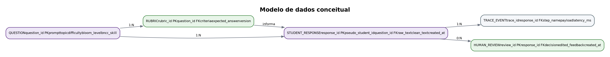
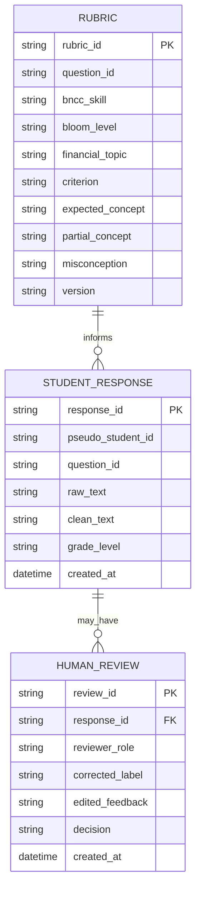

# Modelo de dados

```mermaid
erDiagram
    STUDENT_RESPONSE {
        string response_id PK
        string pseudo_student_id
        string question_id
        string raw_text
        string clean_text
        string grade_level
        datetime created_at
    }

    RUBRIC {
        string rubric_id PK
        string question_id
        string bncc_skill
        string bloom_level
        string financial_topic
        string criterion
        string expected_concept
        string partial_concept
        string misconception
        string version
    }

    HUMAN_REVIEW {
        string review_id PK
        string response_id FK
        string reviewer_role
        string corrected_label
        string edited_feedback
        string decision
        datetime created_at
    }

    STUDENT_RESPONSE ||--o{ HUMAN_REVIEW : may_have
    RUBRIC ||--o{ STUDENT_RESPONSE : informs
```
