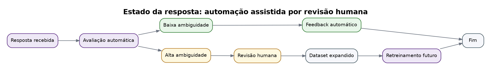
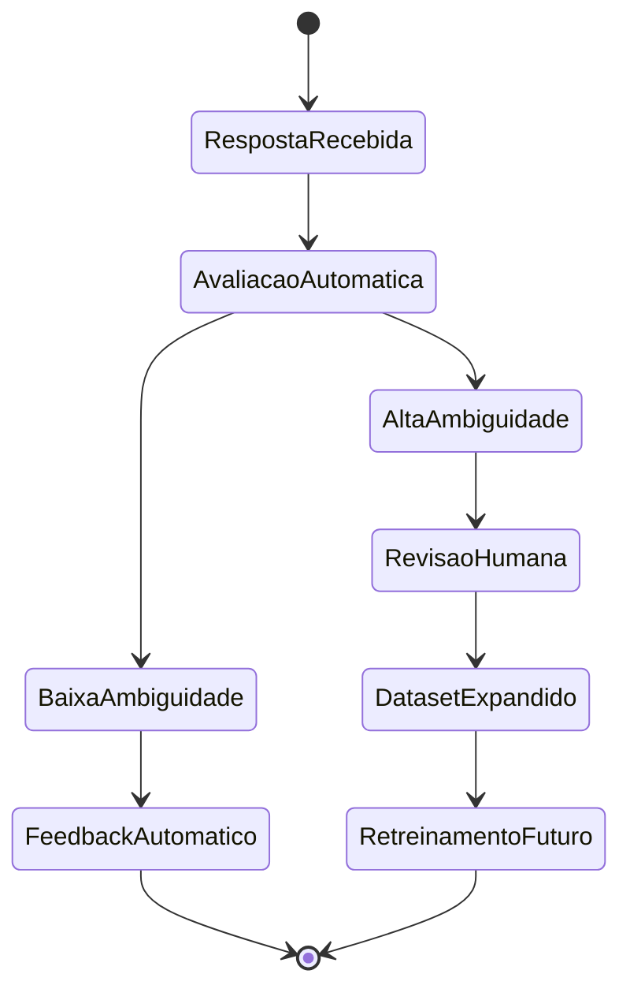

# Human-in-the-loop

A automação total não é o objetivo do TRL inicial. O objetivo é automatizar o que é confiável e acelerar o trabalho humano onde a subjetividade é alta.

```mermaid
stateDiagram-v2
    [*] --> RespostaRecebida
    RespostaRecebida --> AvaliacaoAutomatica
    AvaliacaoAutomatica --> BaixaAmbiguidade
    AvaliacaoAutomatica --> AltaAmbiguidade
    BaixaAmbiguidade --> FeedbackAutomatico
    AltaAmbiguidade --> RevisaoHumana
    RevisaoHumana --> DatasetExpandido
    DatasetExpandido --> RetreinamentoFuturo
    FeedbackAutomatico --> [*]
    RetreinamentoFuturo --> [*]
```
