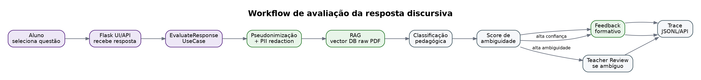
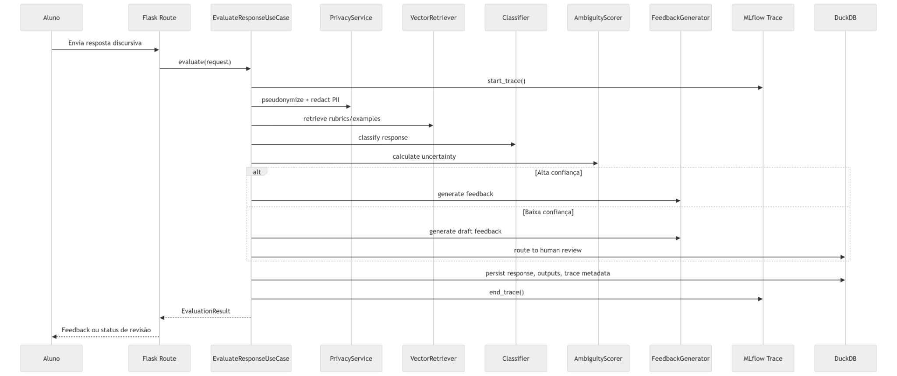
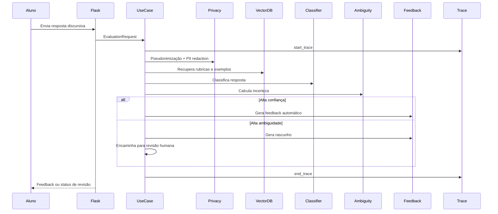
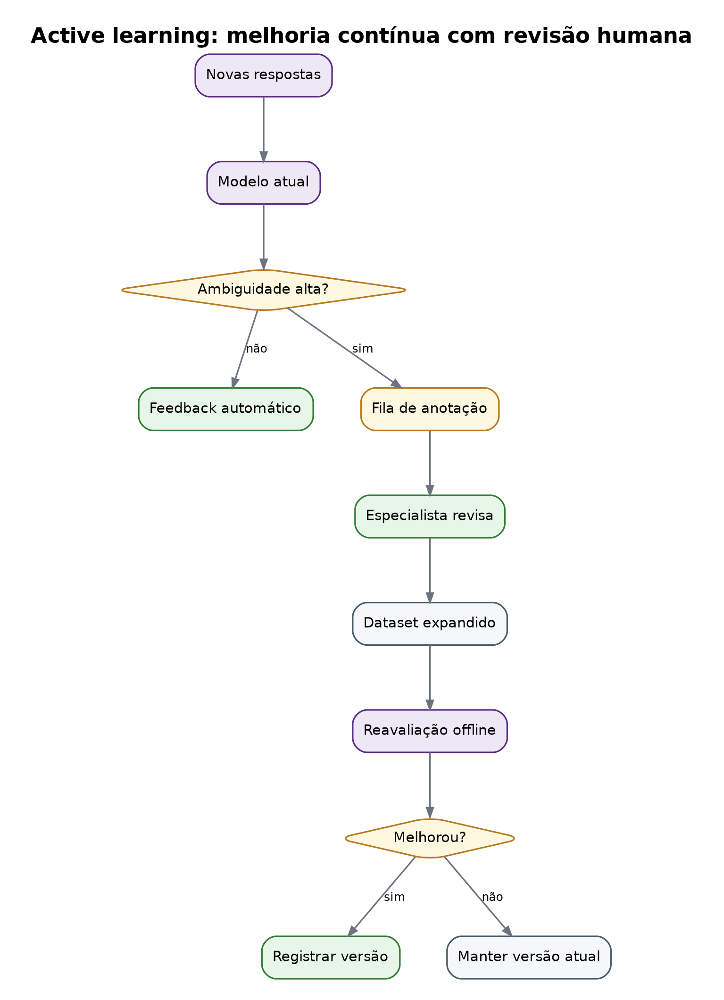
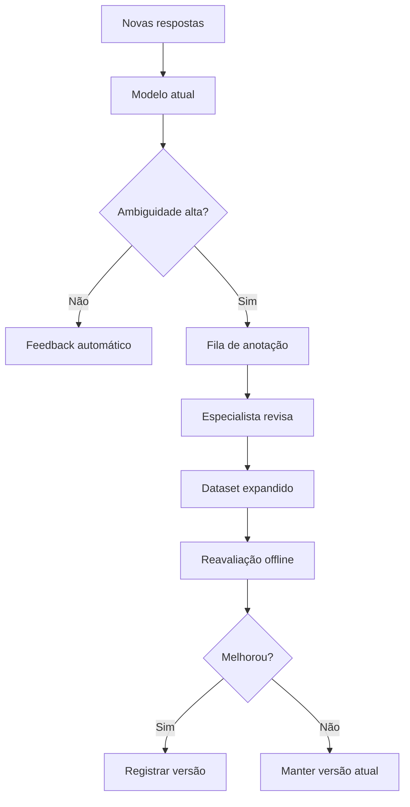

# Workflows

## Resposta do estudante

## Sequência completa de resposta do estudante — versão Mermaid original

```mermaid
sequenceDiagram
    participant Aluno
    participant Flask
    participant UseCase
    participant Privacy
    participant VectorDB
    participant Classifier
    participant Ambiguity
    participant Feedback
    participant Trace

    Aluno->>Flask: Envia resposta discursiva
    Flask->>UseCase: EvaluationRequest
    UseCase->>Trace: start_trace
    UseCase->>Privacy: Pseudonimização + PII redaction
    UseCase->>VectorDB: Recupera rubricas e exemplos
    UseCase->>Classifier: Classifica resposta
    UseCase->>Ambiguity: Calcula incerteza
    alt Alta confiança
        UseCase->>Feedback: Gera feedback automático
    else Alta ambiguidade
        UseCase->>Feedback: Gera rascunho
        UseCase->>UseCase: Encaminha para revisão humana
    end
    UseCase->>Trace: end_trace
    Flask-->>Aluno: Feedback ou status de revisão
```

## Active learning

```mermaid
flowchart TD
    A[Novas respostas] --> B[Modelo atual]
    B --> C{Ambiguidade alta?}
    C -- Não --> D[Feedback automático]
    C -- Sim --> E[Fila de anotação]
    E --> F[Especialista revisa]
    F --> G[Dataset expandido]
    G --> H[Reavaliação offline]
    H --> I{Melhorou?}
    I -- Sim --> J[Registrar versão]
    I -- Não --> K[Manter versão atual]
```
